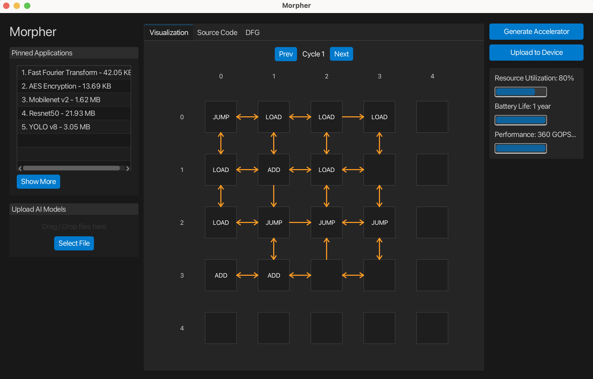

# Morpher GUI



## Getting Started:
Follow these steps to build and run the Morpher GUI on your local machine. 

- Ensure you are using **JDK 17**. (the [Oracle](https://www.oracle.com/java/technologies/downloads/#java17) version or another alternative such as the OpenJDK version)
- **Fork and clone** this repository to your computer.
- Open the project in code editor. If you are using an IDE, [configure it to use the JDK 17](https://www.jetbrains.com/help/idea/sdk.html#set-up-jdk)
- **Add Gradle** (if your IDE has not already detected it). You may refer to this [guide](https://se-education.org/guides/tutorials/gradle.html#adding-gradle-to-the-project).
- Load project dependencies. Either let your IDE run the first Gradle sync automatically, or execute 
    ```
    ./gradlew build
    ```
  from the project root.
- Run the application by executing the `morpher.ui.Main` to launch the GUI.

## FAQ
1. "JavaFX runtime components are missing, and are required to run this application"

    **Cause:** JavaFX 17 is not on the module path at launch time.
    
    **Fix:**
    - You may download [JavaFX 17.0.15 JDK](https://gluonhq.com/products/javafx/)
    - Add the following VM options (adapt the path to your installation):
        ```
        --module-path "\path\to\javafx-sdk-17\lib" --add-modules javafx.controls,javafx.fxml,javafx.swing
        ```
    You may refer to [this video](https://www.youtube.com/watch?v=hS_6ek9rTco) for the process step-by-step.